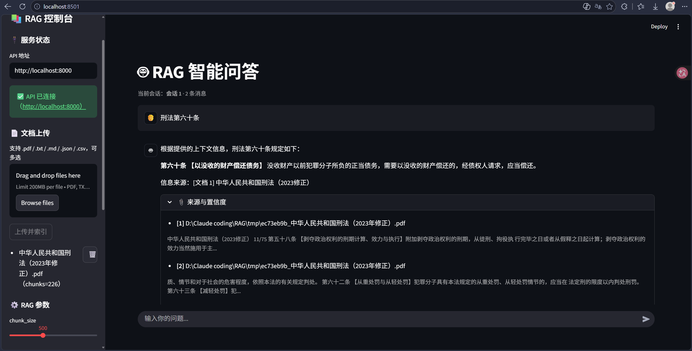

# RAG 检索增强生成问答系统

> 基于 LangChain + LangGraph 的生产级 RAG 问答系统：Streamlit 前端 + FastAPI 后端 + Chroma 持久化向量库 + SQLite 会话元数据。

---

## 1. 项目简介

覆盖 **文档解析 → 混合检索 → 重排 → 生成 → 幻觉自检** 全链路的 RAG 问答系统，属于 Advanced RAG（检索前/后均有增强），并带轻量 Self-RAG 风格的生成后自检-重试闭环。

| 维度 | 说明 |
|---|---|
| 检索增强 | 向量 + BM25 混合检索（RRF 融合）+ Multi-Query 多路召回 + 重排 + 查询改写 |
| 可靠性 | LLM 幻觉自检 + LangGraph 条件分支限次重试（带纠偏 feedback，防死循环） |
| 持久化 | Chroma 向量库磁盘持久化 + SQLite 会话/文档元数据 |
| 架构 | Streamlit（纯 HTTP 客户端）↔ FastAPI REST ↔ RAG 核心 |
| 部署 | Docker 容器化，前后端一键启动 |
| 降级容错 | 无 API 密钥时自动降级为演示模式；重排/混合检索异常逐层降级，主链路不中断 |

## 预览


## 2. 系统架构

```
┌──────────────────┐      HTTP/JSON      ┌──────────────────────────┐
│  Streamlit 前端   │ ──────────────────> │  FastAPI 后端 (api.py)    │
│  (frontend.py)    │ <─────────────────  │  /api/* · 自动生成 /docs  │
│  纯 HTTP 客户端   │                     └────────────┬─────────────┘
└──────────────────┘                                  │ 调用
                                                      ▼
                                          ┌──────────────────────┐
                                          │  RAG 核心 (main.py)   │
                                          │  LangChain+LangGraph  │
                                          └───────┬────────┬─────┘
                                                  │        │
                            Chroma 向量库(磁盘持久化)│        │SQLite(会话/文档元数据)
```

**LangGraph 状态图流程（7 节点 + 条件边）**：

```
START → process_query → multi_query_node → retrieve → rerank_node → generate → hallucination_check_node
                                                                                  │
          is_hallucination==True → 回 generate 重试(≤ max_retry 次) ──────────────┤
                                                                                  ▼
          is_hallucination==False → evaluate → END
```

### LangGraph 条件边幻觉重试逻辑

1. `hallucination_check_node` 用 LLM 判断回答是否与上下文冲突或编造内容，输出 `is_hallucination`。
2. 条件边 `route_after_hallucination`：为 `True` 则跳回 `generate` 重新生成；`False` 则进入 `evaluate`。
3. **防死循环**：`retry_count ≥ max_retry`（默认 2）时强制置 `False` 放行。
4. **纠偏重试**：触发重试时向 `generate` 注入 feedback 提示（要求严格引用上下文），避免相同输入的空转重试。

## 3. 功能特性

- **多格式解析**：`.pdf / .txt / .md / .json / .csv` 文档上传（pypdf 提取 PDF，编码按 utf-8 → gbk → latin-1 自动回退）
- **文档管理**：上传自动分块入库并注入 `doc_id`；删除时同步清理 Chroma 向量与 SQLite 元数据
- **混合检索（Hybrid Search）**：向量稠密检索 + BM25 稀疏检索（jieba 中文分词），RRF 融合——兼顾语义相关与关键词精确命中（如"第6条"这类编号查询）
- **多轮对话 & 查询改写**：结合对话历史消除指代歧义，支持新建/切换/删除/命名会话
- **Multi-Query 多路召回**：LLM 从多角度生成子查询，扩大召回覆盖
- **重排**：对召回结果精打分重排，提升 top 相关性（本地重排模型优先，云端重排接口兜底）
- **幻觉自检重试**：条件分支重生成，降低幻觉回答
- **来源引用 & 置信度打分**：回答附带来源文档片段与置信度
- **调试面板**：展示改写后 Query、Multi-Query 子查询、Rerank 打分明细（JSON 树形）
- **前后端分离**：Streamlit 为零依赖 HTTP 客户端，不耦合 RAG 内部
- **异常容错**：LLM / 向量库 / 文件解析 / BM25 异常全部捕获并逐层降级；无密钥自动降级演示模式

## 4. 环境部署

### 4.1 配置 `.env`

```bash
cp .env.example .env   # Linux/macOS
copy .env.example .env # Windows
```

关键配置项：
```ini
# ---- 密钥与接入点（LLM / Embedding / 重排统一走 OpenAI 兼容协议）----
DEEPSEEK_API_KEY=               # 对话模型密钥
OPENAI_API_KEY=                 # 向量 / 重排密钥（通常同上）
OPENAI_API_BASE=                # OpenAI 兼容接入点，换服务商改这里
DEEPSEEK_MODEL=                 # 对话模型标识
OPENAI_EMBEDDING_MODEL=         # 向量模型标识
RERANKER_MODEL_NAME=            # 重排模型标识

# ---- RAG 超参数 ----
CHUNK_SIZE=500         # 分块大小
CHUNK_OVERLAP=100      # 分块重叠
TOP_K=3                # 检索返回 top-k
MAX_RETRY=2            # 幻觉最大重试次数（防死循环）

# ---- 功能开关（1/0）----
ENABLE_MULTI_QUERY=1   # Multi-Query 多路召回
ENABLE_RERANKER=1      # 重排
ENABLE_HYBRID_SEARCH=1 # BM25+向量混合检索
BM25_CANDIDATE_K=5     # BM25 每路召回候选数
RRF_K=60               # RRF 融合平滑常数
```

### 4.2 本地运行

```bash
python -m venv venv
venv\Scripts\activate   # Windows；Linux/macOS: source venv/bin/activate
pip install -r requirements.txt

# 终端 1：启动 FastAPI 后端（自动生成 /docs 接口文档）
uvicorn api:app --reload --port 8000

# 终端 2：启动 Streamlit 前端
streamlit run frontend.py --server.port 8501
```

浏览器访问 `http://localhost:8501`（前端）、`http://localhost:8000/docs`（接口文档）。

> 冒烟测试：后端启动后运行 `python smoke_api_test.py` 可快速验证主要接口。

### 4.3 Docker 部署

```bash
docker build -t rag-qa-system .
docker run -p 8000:8000 -p 8501:8501 --env-file .env \
  -v rag_data:/app/db rag-qa-system
```

容器内同时启动 uvicorn(8000) 与 streamlit(8501)。
`-v rag_data:/app/db` 将 Chroma 向量库与 SQLite 元数据挂载到数据卷，容器重建后数据不丢失（不挂载则数据随容器销毁）。

## 5. 模块说明

| 模块 | 职责 |
|---|---|
| `main.py` | **RAG 核心**：`DocumentProcessor`（Chroma 持久化、Embedding 维度兼容自检、`delete_documents_by_doc_id` 两级匹配删除）、`Retriever`（单路/多路召回、向量+BM25 混合检索 RRF 融合）、`Generator`（生成/改写/置信度/幻觉检测）、`RAGChain`（LangGraph 7 节点条件边图）、`RAGState(TypedDict)` |
| `config.py` | 全局配置中心：读取 `.env`，集中管理路径、超参、模型标识、功能开关 |
| `api.py` | FastAPI 后端：`/api/doc/upload`、`/api/doc/list`、`/api/doc/{doc_id}`(DELETE)、`/api/chat`、`/api/session`(GET/POST)、`/api/session/{id}/history`、`/api/session/{id}`(DELETE)、`/health`；RAGChain 全局单例 + 互斥锁保护参数临时覆盖 |
| `frontend.py` | Streamlit 前端（纯 HTTP 客户端，requests 调后端，零导入 RAG 内部类） |
| `utils/file_loader.py` | 文件解析：PDF/TXT/MD/JSON/CSV → `Document`，编码回退与异常捕获 |
| `utils/reranker_helper.py` | Multi-Query 生成 + 重排（本地重排模型优先，云端重排接口兜底，再降级原顺序） |
| `utils/bm25_helper.py` | BM25 稀疏检索（rank-bm25 + jieba 分词）与 RRF 多路融合；索引懒加载 + 脏标记重建 |
| `utils/logger.py` | 统一日志（控制台 UTF-8 + 可选文件，防重复 handler） |
| `db/sqlite_db.py` | SQLite 三表：`sessions`/`messages`/`uploaded_docs`（WAL 模式、外键、仅元数据不存向量） |
| `db/chroma_db/` | Chroma 向量库持久化目录 |

### 5.1 文档与会话管理

**文档删除（`DELETE /api/doc/{doc_id}`）**：
- 上传时预生成 `doc_id` 并注入每个 chunk 的 metadata，建立 SQLite 文档 ↔ Chroma 向量关联。
- 删除采用**两级匹配**：优先按 `doc_id` 精确删除；未命中（兼容早期未注入 doc_id 的历史数据）则按文件名兜底匹配 source 字段删除。
- 向量删除后同步清理 SQLite 元数据，确保两侧一致。

**会话管理**：
- 新建会话可自定义名称；留空则自动取默认名，并保证不与已有会话重名（重名自动补后缀）。
- 删除会话时先删除该会话全部消息，再删除会话本身（messages 表外键未声明 CASCADE，需显式清理）；前端同步清空当前会话状态。
- 切换会话时按会话标识重载历史消息，主区域始终显示当前会话名称与消息条数。

### 5.2 前端参数面板的生效范围

侧边栏参数随每次提问发送，对后端单例做**临时覆盖**（互斥锁保护 + 请求后快照恢复）：

| 参数 | 生效范围 |
|---|---|
| `top_k` / Multi-Query / Reranker 开关 | 对**本次查询**即时生效 |
| `chunk_size` / `chunk_overlap` | 只影响**之后上传**文档的分块，不会重切已入库的向量 |

注意：前端参数每次请求都会发送，会覆盖 `.env` 中的同名默认值。

## 6. RAG 优化策略

1. **查询改写（Query Rewrite）**：多轮对话中的"它""那个"等指代通过 LLM 改写为独立完整查询，提升检索命中率（`Generator.rewrite_query`）。
2. **混合检索（Hybrid Search）**：纯向量检索对编号/关键词类查询不敏感，BM25 恰好补足字面精确匹配；两路结果经 RRF 融合（`bm25_helper.rrf_fuse`），被多路同时命中的 chunk 排名自然靠前。
3. **Multi-Query 多路召回**：一个问题生成多个角度子查询，分别检索后融合去重，扩大召回覆盖（`reranker_helper.multi_query_generate`）。
4. **重排（Reranker）**：召回（Bi-Encoder）追求速度和召回率但打分粗；重排对 query-doc 精打分，提升 top-K 相关性。**优先使用本地重排模型**（无网络依赖、无接口配额与费用），本地模型不可用或推理失败时降级到云端重排接口，两级都失败则保持召回原顺序（`reranker_helper.rerank_documents`）。
5. **幻觉自检条件分支**：生成后用 LLM 检测回答是否与上下文冲突；发现幻觉则通过 LangGraph 条件边带纠偏 feedback 跳回重生成，并有 `max_retry` 上限防死循环。

## 7. 调优参数

| 参数 | 影响 | 默认值 |
|---|---|---|
| `chunk_size` | 太小→上下文碎片化丢失语义；太大→引入无关内容 | 500 |
| `chunk_overlap` | 重叠保证跨块语义连贯，防止关键句被硬切分 | 100 |
| `top_k` | 太少→漏答；太多→上下文膨胀干扰模型 | 3 |
| `multi_query_num` | 子查询越多召回越广，但 LLM 调用成本↑ | 3 |
| `bm25_candidate_k` | BM25 每路候选数，越大融合池越宽 | 5 |
| `rrf_k` | RRF 平滑常数，越大各名次贡献越平均 | 60 |
| `max_retry` | 幻觉重试上限，过高则耗时/成本↑ | 2 |

## 8. 项目局限与未来改进

- **向量质量**：默认使用哈希伪向量，仅用于无密钥演示，生产必须配置真实语义向量模型；切换向量模型后系统会自动检测维度不兼容并重建向量集合，需重新上传文档。
- **重排模型**：重排优先使用本地模型，**首次调用会加载并缓存模型（若尚未缓存则需联网下载一次）**；如需完全离线部署，请预先下载模型到本地缓存。本地不可用时自动降级到云端重排接口（需配置 `OPENAI_API_KEY`）。
- **安全**：当前接口无鉴权，仅适合本地/内网使用；生产需加认证、文件类型白名单校验、敏感词过滤、上下文注入防护。
- **并发与性能**：RAGChain 为进程内单例，仅适配单 worker 部署；单次问答串行多次 LLM 调用，延迟偏高，可引入缓存与并行化。
- **查询策略可扩展**：可加入 MMR（最大边际相关）去冗余、HyDE（假设文档）增强召回。
- **会话与记忆**：当前用最近 4 轮做改写；可升级为向量化长期记忆或总结压缩。
- **评估**：可接入 RAGAS 测评框架、加入 golden pair 数据集做自动化效果评测。
